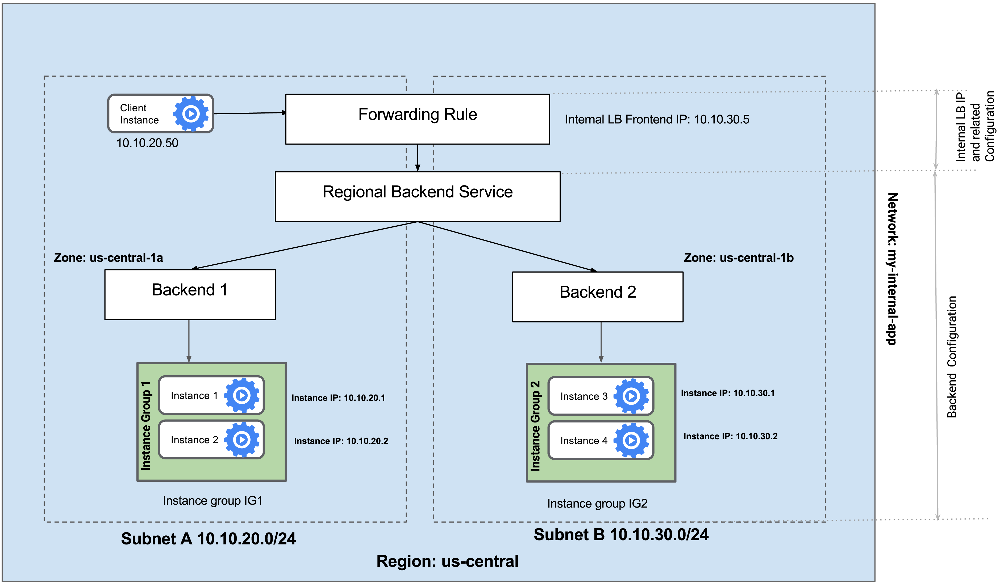

# Treinamento: `Crie um balanceador de carga interno`

## Informações do Laboratório

- **Laboratório:** Google Cloud Skills Boost - GSP216  
- **Link:** [Cloud Skills Boost - GSP216](https://www.cloudskillsboost.google/course_templates/764/labs/558263)  
- **Duração:** 50min
- **Créditos:** 5
- **Data de conclusão:** 2025-07-30

---

*Neste laboratório, você vai criar dois grupos gerenciados de instâncias na mesma região. Depois, você vai configurar e testar um balanceador de carga interno com os grupos de instâncias como back-ends, conforme exibido neste diagrama de rede:*



---

## Conteúdo

As tarefas deste laboratório estão [neste outro arquivo](./Tarefas.md), e foram copiadas da página do curso e re-formatadas pelo Copilot (coisa que não revisei).

---


## Anotações e Aprendizados

### 1. Resumo das Atividades Realizadas

A estrutura criada no laboratório foi:

```
├── Internet
x
├── Balanceador de Carga (internal TCP/UDP/SSL)
│   ├── Grupo de Instâncias - Região 1
│   │   └── VM 1
│   ├── Grupo de Instâncias - Região 2
│   │   └── VM 2
└── VM Teste
```

- O tráfego foi gerado da **VM Teste** para o balanceador de carga;
- Fazendo múltiplas requisições para o balanceador de carga (`curl 10.10.20.2` por exemplo, sendo esse o IP interno dele), dá pra perceber que às vezes é respondido por uma das VMs e às vezes outra ;
